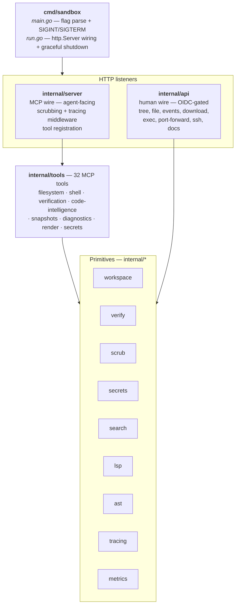
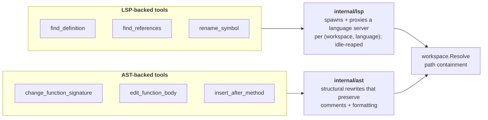

## The brain/hands split

The PromptKit agent (the **brain**) never directly touches a filesystem, runs a process, or makes a network call. All execution happens inside the sandbox container (the **hands**). They communicate over MCP.

The split matters because prompt injection or model error can corrupt the sandbox; it cannot corrupt the agent runtime or the host.

| Responsibility | Lives in |
|---|---|
| Running the model, holding context | Brain (PromptKit) |
| `TodoWrite`, `SubagentDispatch` | Brain |
| Filesystem + process tools: Read, Write, Edit, Glob, Grep, Bash, run_tests/lint/typecheck | Hands (this sandbox) |
| Stateless network tools: WebFetch, WebSearch | Vendor MCP servers, alongside this sandbox — see [Non-sandbox tools](/concepts/non-sandbox-tools/) |

## Transport

MCP runs over **HTTP+SSE**. A client opens `GET /sse`; the server responds with `event: endpoint` carrying a per-session URL like `/message?sessionId=<uuid>`. JSON-RPC requests `POST` to that URL; responses and notifications stream back as `event: message` frames on the SSE connection.

Why HTTP+SSE and not stdio?

- Works identically for local and remote sandboxes.
- Survives `docker exec`-based local invocation if we ever want it.
- One transport across all provider variants keeps the eval matrix honest.

## Layered defence

The container is the real trust boundary — the sandbox binary has no host filesystem access beyond the mounted workspace volume, and the container runtime controls egress. Inside that, the sandbox applies several **defence-in-depth** layers:

### Path containment

Every filesystem-touching tool routes path arguments through [`workspace.Resolve`](/concepts/trust-boundary/) before any I/O. It:

1. Canonicalises the root with `EvalSymlinks`.
2. Resolves the argument (joining with root for relative paths).
3. Walks symlinks through existing components.
4. Rejects anything with `..` escaping the root.

This prevents an agent from reading `/etc/passwd` by asking for `../etc/passwd` or by setting up a symlink that points outside the workspace.

### Command denylist

`Bash` rejects obvious footgun tokens at plausible command positions (`sudo`, `shutdown`, `mkfs`, etc.) before the command runs. It's defence-in-depth, not a security guarantee — quoted subcommands (`bash -c "sudo ..."`) are deliberately not caught to avoid false positives, and determined attackers bypass with `$(echo su)do`. The container remains the real boundary.

See [Bash denylist](/concepts/bash-denylist/).

### Secret scrubbing

Every tool's text output passes through a regex-based scrubber before it leaves the sandbox. Well-known shapes (AWS keys, GitHub PATs, OpenAI/Anthropic keys, JWTs, PEM private keys, basic-auth URLs, `API_KEY=...` assignments) are replaced with `[REDACTED:<type>]`.

See [Secret scrubbing](/concepts/secret-scrubbing/).

### Post-edit lint feedback

After every successful `Edit` on a Go project, the tool runs `golangci-lint` with a short timeout and appends any findings for the edited file to the response. This is the proposal's "single biggest quality win" — the agent sees mistakes immediately, before it calls `run_lint` or `run_tests`.

See [Post-edit lint feedback](/concepts/post-edit-lint-feedback/).

## Process model

Each package has one clear responsibility. The separation makes it easy to add a tool (drop in an `internal/tools/foo.go` + `RegisterFoo`), a language detector (implement the `verify.Detector` interface), or a new human-wire endpoint (mount it on `internal/api/server.go`).

## Code intelligence

Two of the tool categories — LSP-backed and AST-backed — sit on top of dedicated primitives that bring language-aware capabilities into the sandbox without bypassing path containment.

**LSP-backed tools** answer queries that need real type/scope resolution — cross-file definitions, all-references searches, rename-with-conflict-detection. The sandbox spawns the language server lazily per `(workspace, language)` pair, talks LSP over stdio, and surfaces structured results. Production wiring is Go-first today (`gopls`); Python / Node / Rust language-server bindings are tracked as follow-ups. See [LSP navigation](/tools/lsp-navigation/) for the full table.

**AST-backed tools** perform structural edits — replacing a function body, changing a signature with cascading callsite updates, inserting a method after a named one — without breaking comments or formatting. Plain-text `Edit` can't do this safely; the AST tools can. See [AST edits](/tools/ast-edits/).

Both layers route through the same `workspace.Resolve` that every filesystem-touching tool uses. Language servers and AST writers don't get a side door around the trust boundary.

## Tool naming and Claude Code compatibility

The 32 tools use **two naming conventions in parallel**, and the split is intentional:

| Convention | Tools | Why |
|---|---|---|
| **PascalCase** | `Read`, `Write`, `Edit`, `Glob`, `Grep`, `Bash`, `BashOutput`, `KillShell` | Mirror [Claude Code's built-in tool names](https://docs.claude.com/en/docs/claude-code/) verbatim. Argument shapes match too — e.g. `Edit` takes `file_path` / `old_string` / `new_string` / `replace_all`, `Read` takes `file_path` / `offset` / `limit` — so a Claude-Code-trained tool wrapper works against this sandbox without rewiring. |
| **snake_case** | `run_tests`, `run_lint`, `run_typecheck`, `find_definition`, `change_function_signature`, `render_mermaid`, `snapshot_create`, `secrets_available`, … | Project-native, MCP-idiomatic. Cover capabilities Claude Code doesn't ship: verification, LSP nav, AST edits, secrets, snapshots, render. |

PromptKit's codegen agent reuses Claude-Code-trained patterns for the file/shell core; everything else is sandbox-specific. If the day comes that we need to rename PascalCase tools to fit a downstream convention, both names can be served simultaneously through MCP for one release before the old form is retired.

## Sandbox lifecycle

- One sandbox per session.
- Sandbox provider (in the PromptKit repo, not this one) creates a container with a fresh ephemeral volume.
- The container's MCP server starts; the agent connects.
- Agent runs to completion.
- Container destroyed; volume reclaimed.

Warm-volume mode (volume reattached across sessions for the same task) is an opt-in for fast iteration cycles; the sandbox code itself doesn't know or care.

## What's NOT in the sandbox

- **The sandbox provider abstraction** (local Docker, remote Docker, e2b, Modal, Daytona adapters). Lives in the PromptKit repo.
- **Credentials for `git push` / GitHub PRs**. Bring-your-own — supplied at `docker run` time as env vars or mounted files; the sandbox scrubs known-secret shapes from output but doesn't manage identity.
- **gVisor / Firecracker / microVM sandboxing**. Third-party providers can provide stronger isolation; `LocalDockerProvider` gets you a container.
