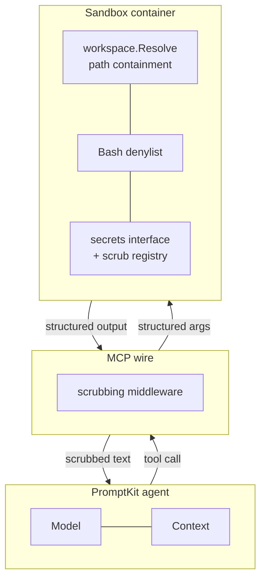

import { Card, CardGrid } from '@astrojs/starlight/components';
import Terminal from '../../components/Terminal.astro';

## What it is

The codegen sandbox is the **hands** of a PromptKit codegen agent. The agent (the **brain**) runs the model and holds context; the sandbox executes everything that touches a filesystem, spawns a process, or makes a network call. They talk over MCP (HTTP+SSE). Prompt injection or model error can corrupt the sandbox; it cannot corrupt the agent runtime or the host.

## Tool surface

<CardGrid stagger>
  <Card title="Filesystem" icon="document">
    **Read**, **Write**, **Edit** operate on a single workspace root. Every path is resolved and checked for containment before any I/O. Edit returns post-edit lint findings inline.
  </Card>
  <Card title="Search" icon="magnifier">
    **Glob** (mtime-sorted, gitignore-aware) and **Grep** (ripgrep-backed) for fast navigation. Structured `file:line:rule: message` output on lint results.
  </Card>
  <Card title="Shell" icon="seti:bash">
    **Bash** foreground + background (via `BashOutput` / `KillShell`). Per-call timeouts kill the whole process group; a small denylist catches footguns.
  </Card>
  <Card title="Verification" icon="approve-check">
    **run_tests**, **run_lint**, **run_typecheck** use project-type detection (Go today; more languages behind the Detector interface) to run the right command.
  </Card>
  <Card title="Vendor MCP for the web" icon="rss">
    The sandbox deliberately doesn't ship WebFetch/WebSearch — wire vendor MCP servers (Brave, Exa, Tavily, official `fetch`) alongside it instead. See [non-sandbox tools](/concepts/non-sandbox-tools/).
  </Card>
  <Card title="Safe by default" icon="shield">
    Path containment, command denylist, secret scrubbing — layered defence-in-depth. The Docker container is the real trust boundary.
  </Card>
</CardGrid>

## Pull it, run it

One container, one flag, one workspace mount. The sandbox is a provider behind PromptKit's agent — PromptKit asks for a sandbox, the provider returns an MCP endpoint.

<Terminal
  title="codegen-sandbox · local"
  prompt="❯"
  lines={[
    { type: 'command', text: 'docker run -p 8080:8080 -v $PWD:/workspace ghcr.io/altairalabs/codegen-sandbox' },
    { type: 'comment', text: '# mcp over http+sse · workspace mounted read-write' },
    { type: 'success', text: 'codegen-sandbox listening on :8080 (workspace=/workspace)' },
    { type: 'muted', text: '  32 tools registered · scrubbing on · denylist on' },
  ]}
/>

## How it fits

The codegen sandbox is one **provider** behind PromptKit's agent — the piece that actually runs tool calls. PromptKit asks for "a sandbox"; the provider returns an MCP endpoint. The agent then calls tools over MCP; the sandbox executes them inside a container. The star chart at the top of this page is that path end to end.

## Defence in depth

  next · getting started
  <a href="/getting-started/">Build, run and talk to the sandbox →</a>

